linux下 64位系统

安装nodejs(回头再写)

安装gitbook（回头再写）

## 制作电子书并上传到网页：

1、在 [Github](https://links.jianshu.com/go?to=github.com) 上新建一个仓库 *Repository* （当然你首先得有Github账号），命名为 *makeru*。选择项目类型为公开 Public，并且勾选 *Initialize this repository with a README* 以便创建README文件(建议勾选，似乎是gitbook本地编译时必须的文件)

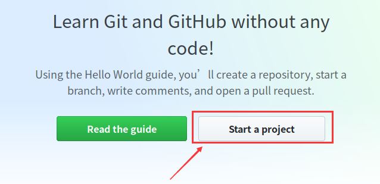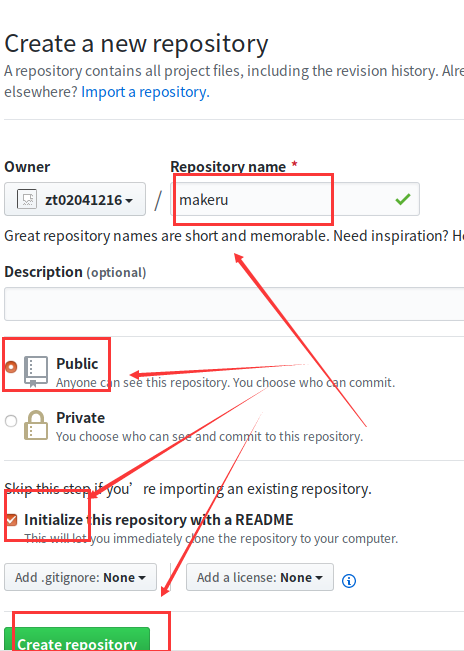

2、创建好以后把远程仓库克隆到本地你特定的目录下（我的是0_Ebook目录），切换到makeru目录下可以看看初始目录有哪些文件（复制此时的makeru的网址）

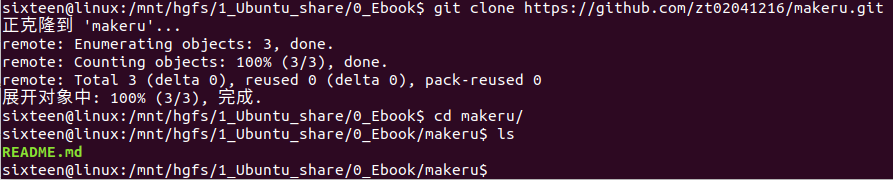

3、命令行中键入gitbook init初始化项目，初次操作会显示 Installing GitBook 3.2.3 ，需要等待一些时间让他自动安装一些插件，完成后会提示 info: initialization is finished ，Gitbook 自动创建了 SUMMARY.md 文件，这是电子书的目录文件

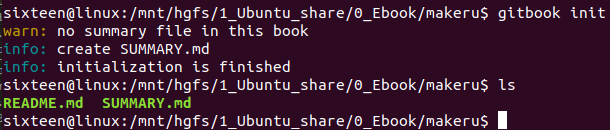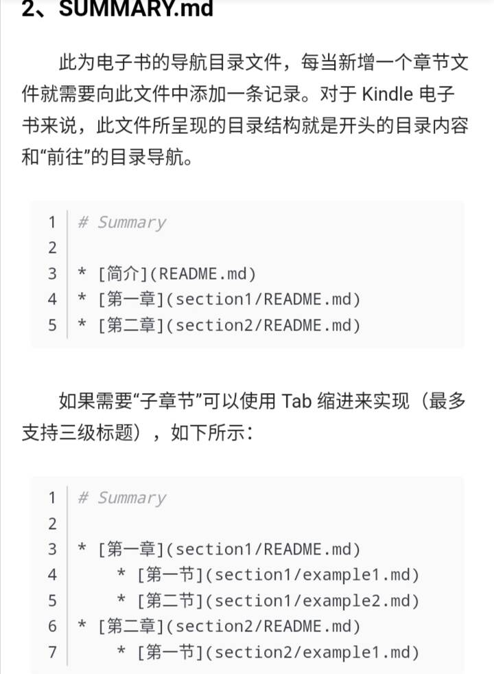

4、命令行中键入gitbook serve会启动一个本地的服务（同时会新增一个 _book 目录），在浏览器其中访问地址就可以实时预览电子书

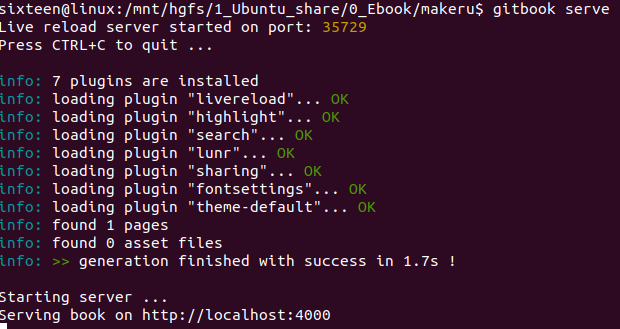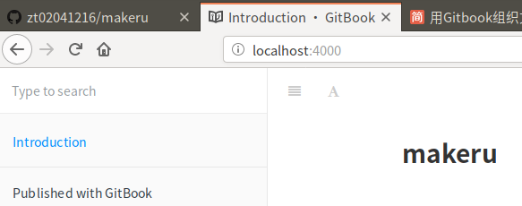

预览成功！！！

## 第二阶段：展示到Github的page中

(1) 在 makeru 的项目里点击 settings ，找到 GitHub Pages

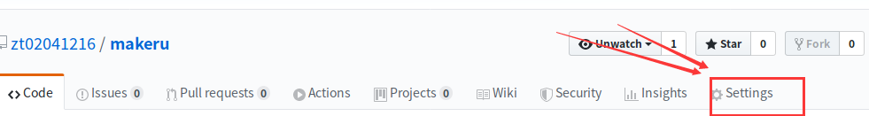

(2)、Source 我选择用 docs 目录下的内容来呈现项目文档，但这时发现选项是「禁用」的！！

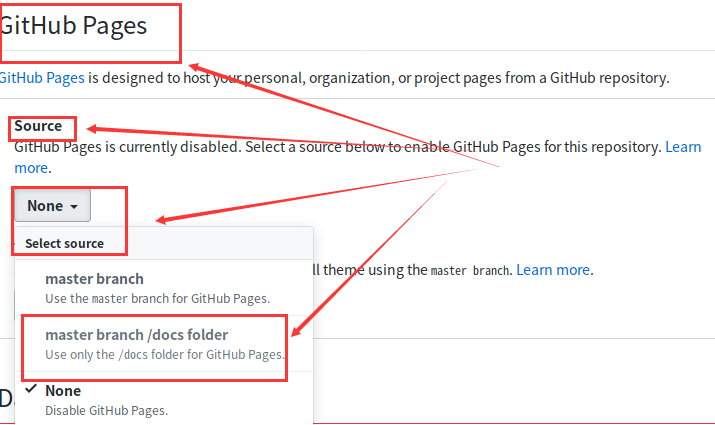

（2) 在本地环境目录下你准备好的文件全部编译到 docs 目录，在 SUMMARY.md 中添加访问链接后可直接在左侧的目录树显示。命令行中键入gitbook build . docs，将文件都编译到 docs 目录下

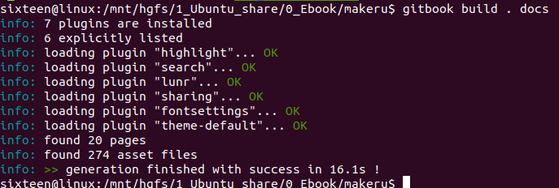

（3）然后将编译好的文件 PUSH 到远端仓库

$ git add *

$ git commit -m"Inital commit"  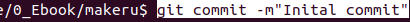

$ git push -u origin master   

然后再输入你的github的账号和密码（注：ubuntu命令行密码输入时候是没有显示的，所以密码尽量输入正确）

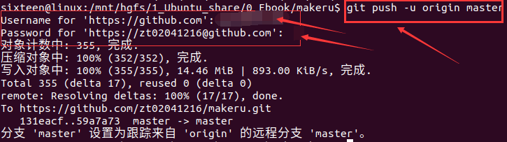

（4）此时，再去 Settings 里去设置 Pages 的 Source，,发现 master branch/docs folder 已经是可选的， 选择后页面刷新，生成访问地址。

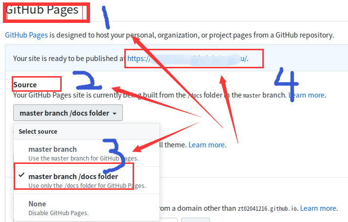

恭喜，能走到这一步，证明我们已经成功的将文档发布到 Github 的 Pages ，我们只需要访问地址即可: